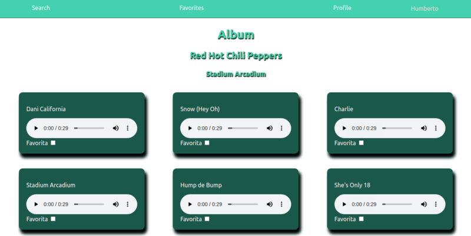
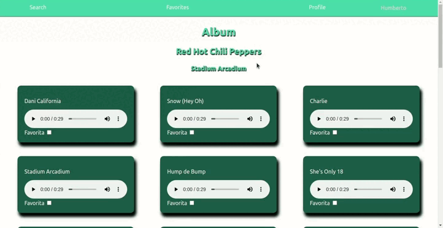

# Boas vindas ao repositório do projeto de Trybetunes!

## Descrição do projeto

Neste projeto eu pude desenvolver o TrybeTunes, uma aplicação capaz de reproduzir músicas das mais variadas bandas e artistas, criar uma lista de músicas favoritas e editar o perfil da pessoa usuária logada. Essa aplicação é capaz de:

- Fazer login;
- Pesquisar por uma banda ou artista;
- Listar os álbuns disponíveis dessa banda ou artista;
- Visualizar as músicas de um álbum selecionado;
- Reproduzir uma prévia das músicas deste álbum;
- Favoritar e desfavoritar músicas;
- Ver a lista de músicas favoritas;
- Ver o perfil da pessoa logada;
- Editar o perfil da pessoa logada;

---

## Instalação do projeto localmente

Após cada um dos passos, haverá um exemplo do comando a ser digitado para fazer o que está sendo pedido, caso tenha dificuldades, mande mensagem para o meu e-mail _humberto_bonadiman@hotmail.com_.

1. Abra o terminal e crie um diretório no local de sua preferência com o comando **mkdir**:
```javascript
  mkdir projetos-humberto
```

2. Entre no diretório que acabou de criar e depois clone o projeto:
```javascript
  cd projetos-humberto
  git clone git@github.com:Humberto-Bonadiman/Project-Trybetunes.git
```

3. Acesse o diretório do projeto e depois utilize o comando **npm i** para instalar todas as dependências necessárias:
```javascript
  cd Project-Trybetunes
  npm i
```

4. Por último, rode o comando **npm start** e acesse o projeto via browser, no caminho `http://localhost:3000/Project-Trybetunes`.

---

## Ilustrações

Página de login


Página de pesquisa


Resultado da pesquisa


Album selecionado



Favoritar músicas



Página de edição do perfil


---

## Requisitos do projeto

## 1. Crie as rotas necessárias para a aplicação
Você deve utilizar o `BrowserRouter` pra criar as rotas da sua aplicação e cada rota deverá renderizar um componente específico. Crie cada componente dentro da pasta `src/pages`, conforme o indicado abaixo:

- a rota `/` deve renderizar um componente chamado `Login`. Este componente deve ter uma `div` com o atributo `data-testid="page-login"` que envolva todo seu conteúdo;

- a rota `/search` deve renderizar um componente chamado `Search`. Este componente deve ter uma `div` que envolva todo seu conteúdo e ter o atributo `data-testid="page-search"`;

- a rota `/album/:id` deve renderizar um componente chamado `Album`. Este componente deve ter uma `div` que envolva todo seu conteúdo e ter o atributo `data-testid="page-album"`;

- a rota `/favorites` deve renderizar um componente chamado `Favorites`. Este componente deve ter uma `div` que envolva todo seu conteúdo e ter o atributo `data-testid="page-favorites"`;

- a rota `/profile` deve renderizar um componente chamado `Profile`. Este componente deve ter uma `div` que envolva todo seu conteúdo e ter o atributo `data-testid="page-profile"`;

- a rota `/profile/edit` deve renderizar um componente chamado `ProfileEdit`. Este componente deve ter uma `div` que envolva todo seu conteúdo e ter o atributo `data-testid="page-profile-edit"`;

- para qualquer outra rota não mapeada, deve ser renderizado um componente chamado `NotFound`. Este componente deve ter uma `div` que envolva todo seu conteúdo e ter o atributo `data-testid="page-not-found"`;

## 2. Crie um formulário para identificação
Dentro do componente `Login`, que é renderizado na rota `/`, crie um formulário para que a pessoa usuária se identifique com um nome.
  
  * Você deve criar um campo para que a pessoa usuária insira seu nome. Este campo deverá ter o atributo `data-testid="login-name-input"`.

  * Crie um botão com o texto `Entrar`. Este botão deverá ter o atributo `data-testid="login-submit-button"`.

  * O botão para entrar só deve ser habilitado caso o nome digitado tenha 3 ou mais caracteres.

  * Ao clicar no botão `Entrar`, utilize a função `createUser` da `userAPI` para salvar o nome digitado. A função `createUser` espera receber como argumento um objeto com as informações da pessoa: 
  ```
  createUser({name: "Nome digitado"});
  ```
  *Obs:* Você verá nos requisitos mais a frente que você poderá passar outras informações para a `createUser`, mas não se preocupe com isso agora. Por enquanto você pode passar somente um objeto com a propriedade `name`.

  * Enquanto a informação da pessoa usuária é salva, uma mensagem com o texto `Carregando...` deve aparecer na tela. **Dica:** Você precisará dessa mensagem várias vezes no futuro, então é uma boa ideia criar um componente para ela ;)

  * Após a informação ter sido salva, faça um redirect para a rota `/search`.
  
## 3. Crie um componente de cabeçalho
Crie um componente chamado `Header`, dentro da pasta `src/components`.

  * Crie esse componente com a tag `header` envolvendo todo seu conteúdo e com o atributo `data-testid="header-component"`;

  * Renderize o componente de cabeçalho nas páginas das rotas `/search`, `/album/:id`, `/favorites`, `/profile` e `/profile/edit`; 

  * Utilize a função `getUser` da `userAPI` para recuperar o nome da pessoa logada e exiba essa informação na tela. Você pode usar qualquer tag HTML que faça sentido, desde que ela tenha o atributo `data-testid="header-user-name"`.

  * Enquanto estiver aguardando a resposta da `getUser`, exiba apenas a mensagem de `Carregando...`.

## 4. Crie os links de navegação no cabeçalho

  * Crie o link que redireciona para a página de pesquisa dentro do componente `Header`. Este link deve ter o atributo `data-testid="link-to-search"`.

  * Crie o link que redireciona para a página de músicas favoritas dentro do componente `Header`. Este link deve ter o atributo `data-testid="link-to-favorites"`.

  * Crie o link que redireciona para a página de exibição de perfil dentro do componente `Header`. Este link deve ter o atributo `data-testid="link-to-profile"`.

## 5. Crie o formulário para pesquisar artistas
Este formulário deve conter um input e um botão para que seja possível pesquisar os álbums de uma banda ou artista. Crie o formulário dentro do componente `Search`, que é renderizado na rota `/search`.
    
  * Crie um campo para pessoa digitar o nome da banda ou artista a ser pesquisada. Esse campo deve ter o atributo `data-testid="search-artist-input"`.
  
  * Crie um botão com o texto `Pesquisar`. Esse botão deve ter o atributo `data-testid="search-artist-button"`.

  * O botão só deve estar habilitado caso o nome do artista tenha 2 ou mais caracteres.

## 6. Faça a requisição para pesquisar artistas
Com a estrutura da tela de pesquisa criada, agora é hora de fazer uma requisição e receber a lista de álbums da banda ou artista pesquisada.

  * Ao clicar no botão de `Pesquisar`, limpe o valor do input e faça uma requisição utilizando a função do arquivo `searchAlbumsAPIs.js`. Lembre-se que essa função espera receber uma string com o nome da banda ou artista.

  * Enquanto aguarda a resposta da API, esconda o input e o botão de pesquisa e exiba a mensagem `Carregando...` na tela.

  * Após receber a resposta da requisição exibir na tela o texto `Resultado de álbuns de: <artista>`, onde `<artista>` é o nome que foi digitado no input.

  * Liste os álbuns retornados. A API irá retorna um *array* de objetos. Cada objeto terá a seguinte estrutura: 
  ```
  [
    {
      artistId: 12,
      artistName: "Artist Name",
      collectionId: 123,
      collectionName: "Collection Name",
      collectionPrice: 12.25,
      artworkUrl100: "https://url-to-image",
      releaseDate: "2012-03-02T08:00:00Z",
      trackCount: 8,
    }
  ]

  ```

  * Ao listar os álbuns, crie um link em cada card para redirecionar para a página do álbum. Este link deve ter o atributo ```data-testid={`link-to-album-${collectionId}`}```. Onde `collectionId` é o valor da propriedade de cada Álbum.

  * Este link deve redirecionar para a rota `/album/:id`, onde `:id` é o valor da propriedade `collectionId` de cada Álbum da lista recebida pela API.

  * Se nenhum álbum for encontrado para o nome pesquisado, a API irá retornar um array vazio. Nesse caso, a mensagem `Nenhum álbum foi encontrado` deverá ser exibida.

## 7. Crie a lista de músicas do álbum selecionado
Agora que está tudo pronto, você poderá exibir a lista de músicas do álbum selecionado. Crie a lista dentro do componente `Album`, que é renderizado na rota `/album/:id`.
  
  * Ao entrar na página, faça uma requisição utilizando a função `getMusics` do arquivo `musicsAPI.js`. Lembre-se que essa função espera receber uma string com o id do álbum.

  * Exiba o nome da banda ou artista na tela. Você pode usar qualquer tag HTML que faça sentido, desde que ela tenha o atributo `data-testid="artist-name"`.

  * Exiba o nome do álbum e nome da banda ou artista na tela. Você pode usar qualquer tag HTML que faça sentido, desde que ela tenha o atributo `data-testid="album-name"`.

  * Liste todas as músicas do álbum na tela. Para isso, crie um componente chamado `MusicCard` que deverá exibir o nome da música (propriedade `trackName` no objeto recebido pela API) e um player para tocar o preview da música (propriedade `previewUrl` no objeto recebido pela API).

  Para tocar o preview, você deve usar a tag `audio` do próprio HTML. Sua implementação é assim: 
  ```javascript
  <audio data-testid="audio-component" src={ previewUrl } controls>
    <track kind="captions" />
      O seu navegador não suporta o elemento <code>audio</code>.
  </audio>
  ```

## 8. Crie o mecanismo para adicionar músicas na lista de músicas favoritas
Você já consegue listar as músicas dos álbuns, nessa etapa você poderá marcar quais são as músicas que você mais gosta.

  * No componente `MusicCard`, crie um input do tipo `checkbox` para marcar as músicas favoritas. Esse input deve conter uma `label` com o texto `Favorita` e, o input, deve possuir o atributo ```data-testid={`checkbox-music-${trackId}`}```, onde `trackId` é a propriedade `trackId` do objeto recebido pela API.

  * Para adicionar uma música a lista de favoritas, utilize a função `addSong` da `favoriteSongsAPI`. Você deve passar para essa função um objeto no mesmo formato que você recebe da API `getMusics`.

  * Enquanto aguarda o retorno da função `addSong`, renderize a mensagem de `Carregando...`.

  * Ao entrar na página, utilize a função `getFavoriteSongs` da `favoriteSongsAPI` para recuperar a lista de músicas favoritas e marque as músicas que já foram favoritadas.

## 9. Crie o mecanismo para remover músicas na lista de músicas favoritas
Depois de listar e favoritar as músicas de um álbum, você também deve poder remover uma música da lista de favoritas.

  * Ao clicar em uma música que já está marcada como favorita, ela deve ser removida da lista de músicas favoritas. Para isso você deve usar a função `removeSong` da `favoriteSongsAPI`. Essa API espera receber um objeto no mesmo formato que foi passado anteriormente para a função `addSong`.

  * Enquanto aguarda o retorno da função `removeSong`, renderize a mensagem de `Carregando...`.

## 10. Crie a lista de músicas favoritas
Crie a lista dentro do componente `Favorites`, que é renderizado na rota `/favorites`.

  * Ao entrar na página, utilize a função `getFavoriteSongs` da `favoriteSongsAPI` para recuperar a lista de músicas favoritas.

  * Enquanto aguarda a resposta da API, exiba a mensagem `Carregando...`.

  * Após receber o retorno da função `getFavoriteSongs`, utilize o  componente `MusicCard` para renderizar a lista de músicas favoritas.

  * Nesta página deve ser possível desfavoritar as músicas. Para isso utilize a função `removeSong` da `favoriteSongsAPI`.

  * Enquanto aguarda a resposta da API, exiba a mensagem `Carregando...`.

  * Após remover a música, atualize a lista usando a função `getFavoriteSongs`. Lembre-se de exibir a mensagem `Carregando...` enquanto aguarda o retorno da API.

# Requisitos bônus

## 11. Crie a exibição de perfil
Crie a exibição do perfil dentro do componente `Profile`, que é renderizado na rota `/profile`.

  * Utilize a função `getUser` da `userAPI` para recuperar as informações da pessoa logada.

  * Enquanto aguarda a resposta da API, exiba a mensagem `Carregando...`.

  * Após receber o retorno da `getUser`, exiba o nome, o email, a descrição e a imagem da pessoa logada.

  * Para exibir a imagem, use a tag HTML `img` com o atributo `data-testid="profile-image"`;

  * Crie um link que redirecione para a página de edição de perfil (rota `/profile/edit`). Este link deve ter o texto `Editar perfil`.

## 12. Crie o formulário de edição de perfil
Crie o formulário de edição de perfil dentro do componente `ProfileEdit`, que é renderizado na rota `/profile/edit`.

  * Utilize a função `getUser` da `userAPI` para recuperar as informações da pessoa logada.

  * Enquanto aguarda a resposta da API, exiba a mensagem "Carregando...".

  * Após receber as informações da pessoa logada, renderize um formulário já preenchido com os seguintes campos:

    * Um campo para alterar o nome da pessoa usuária. Este campo precisa ter o atributo `data-testid="edit-input-name"`;

    * Um campo para alterar o email da pessoa usuária. Este campo precisa ter o atributo `data-testid="edit-input-email"`;

    * Um campo para alterar a descrição da pessoa usuária. Este campo precisa ter o atributo `data-testid="edit-input-description"`;

    * Um campo para alterar a foto da pessoa usuária. Este campo precisa ter o atributo `data-testid="edit-input-image"`;

    * Um botão para salvar as informações alteradas. Este botão precisa ter o atributo `data-testid="edit-button-save"`.

  * Para poder habilitar o botão de enviar, todos os campos precisam estar preenchidos (não podem estar vazios).

  * O campo de email, além de não estar vazio também precisa verificar que o email tem um formato válido, ou seja, deve seguir o padrão `test@test.com`.
  
  * O botão de salvar as informações só deve ser habilitado quando todos os campos estiverem válidos, ou seja, todos campos preenchidos e o campo de email com um valor em formato válido.

  * Quando o botão estiver habiltado, utilize a função `updateUser` da `userAPI` para atualizar as informações da pessoa usuária. Essa API espera receber um objeto no seguinte formato:
  ```
    {
      name: '',
      email: '',
      image: '',
      description: '',
    }
  ```

  * Enquanto aguarda a resposta da API, exiba a mensagem `Carregando...`.

  * Ao finalizar o processo de edição, redirecione a pessoa logada para a página de exibição de perfil (rota `/profile`).
